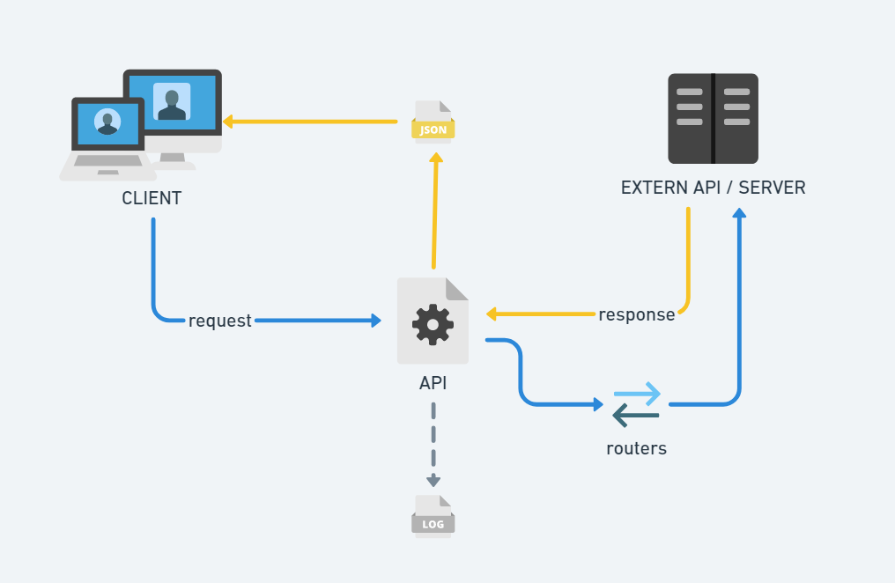
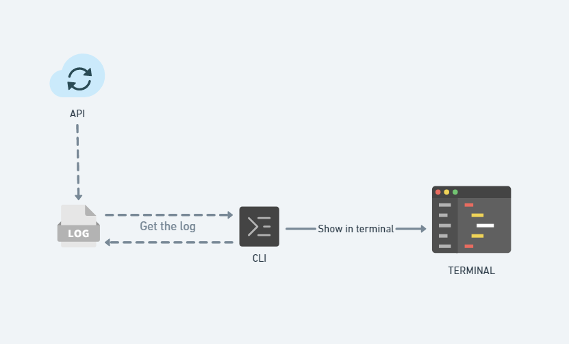

# 42Labs (Selective Process)

The project consists of a week creating a REST API and a CLI using the
C programming language where creativity is the limit. This challenge is
an opportunity to take the first step into the market with the 42Labs
program from 42 São Paulo.

## **Contents**

- [Tools](#tools)

- [API](#api)

- [CLI](#cli)

- [Collaborators](#collaborators)

- [Bibliography](#bibliography)

## **Tools**

### **Development tools:**

- [Development tools](https://www.a2hosting.com/kb/developer-corner/testing-and-development/installing-development-tools-on-an-unmanaged-server) such as git, gcc and make

### **To install development tools in Ubuntu:**
- apt-get install build-essential

### **To make a flowchart:**

- Whimsical:

**API:**

**CLI:**

## **Libraries**

### **Mongoose:**

### Installation:
- Access [Mongoose](https://mongoose.ws/documentation/) to access the User Guide.

### **Libcurl:**

### Installation:

- apt-get install libcurl4-openssl-dev

### Flags for compilation:
 - -lcurl

### **Test tools**

VS Code [Thunder Client](https://marketplace.visualstudio.com/items?itemName=rangav.vscode-thunder-client) extension.

## **API:**

>API will get you out of boredom or probably make you laugh

### **How to use:**

### To make a Request:

Commands:
- make run
- Acess [localhost](http://www.localhost:8000)

**GET:** /
- return: Activity suggestions.

**GET:** /joke
- return: Random Jokes.

## **CLI (Command Line Interface)**

> CLI will show real-time log file data.

### **How to use:**
- make run

## **Collaborators:**

- Flavio (flda-sil)

- Gabriel (gsilva-v)

- Gustavo (gusalves)

## **Bibliography:**

[A anatomia de uma API RESTful](https://thiagolima.blog.br/a-anatomia-de-uma-api-restful-80df2aca158e)

[Qual é a diferença entre HTTP e HTTPS?](https://www.alura.com.br/artigos/qual-e-diferenca-entre-http-e-https)

[API REST: o que é e como montar uma API sem complicação?](https://blog.betrybe.com/desenvolvimento-web/api-rest-tudo-sobre/)

[Afinal, o que é JSON e para que ele serve?](https://rockcontent.com/br/blog/json/#:~:text=O%20arquivo%20.,utiliz%C3%A1%2Dlos%20rapidamente%20na%20aplica%C3%A7%C3%A3o.)

[URI vs. URL: What’s the Difference?](https://blog.hubspot.com/website/uri-vs-url)

[Big List of Free and Open Public APIs (No Auth Needed)](https://mixedanalytics.com/blog/list-actually-free-open-no-auth-needed-apis/)

[O que é um endpoint: Como proteger este tipo de dispositivo](https://blog.milvus.com.br/o-que-e-endpoint/)

[Libcurl](https://curl.se/libcurl/c/libcurl-tutorial.html)

[Mongoose Library](https://mongoose.ws/documentation/#introduction)